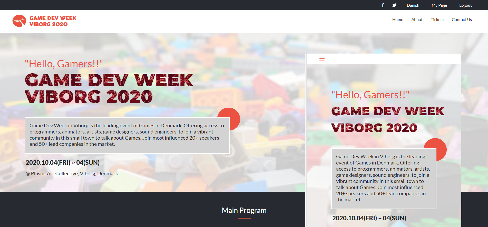

<h3 align="center">Capstone HTML and CSS Project - Conference Web Site</h3>

<div align="center">

[]()
[](https://github.com/fdfragoso/capstone-conference-page/issues)
[](https://github.com/fdfragoso/capstone-conference-page/pulls)
[](/LICENSE)
[](https://github.com/fdfragoso)
[](https://twitter.com/fdfragoso)

</div>

---

## 📝 Content
<p align="center">
<a href="#about">About</a>&nbsp;&nbsp;&nbsp;|&nbsp;&nbsp;&nbsp;
<a href="#installing">Installing</a>&nbsp;&nbsp;&nbsp;|&nbsp;&nbsp;&nbsp;
<a href="#built_using">Built with</a>&nbsp;&nbsp;&nbsp;|&nbsp;&nbsp;&nbsp;
<a href="#authors">Author</a>
</p>


## 🧐 About <a name = "about"></a>
<h3 align="center"> This is an assigment for Microverse's HTML and CSS course. The goal was to create a conference webpage. This page should follow some requirements and some design. This design is based on the CC Global Summit 2015 <a href="https://www.behance.net/gallery/29845175/CC-Global-Summit-2015">main page</a>.</h3>.
The page should contain a index, tickets and about site. With all the expected information about a conference webpage should have. 
To follow all those requirements, the author created the fictional event Games Week Viborg 2020 (the author lives in Viborg, Denmark). In this event some lead people in the game development field would be present, taking place in october.
All in all this project was developed during the capstone html and css project phase of Microverse to show all learned in this area. 

<p align="center">
  
</p>

---

## 🔧 Built with<a name = "built_using"></a>

- [HTML and CSS](https://www.w3schools.com/) - HTML5 and CSS3;
- [W3 HTML Validator](https://validator.w3.org/) - A Markup Validation Service;
- [Stickler](https://stickler-ci.com) - A CSS Linter;
- [Bootstrap 4](https://getbootstrap.com/) - Bootstrap · The most popular HTML, CSS, and JS library in the world;

## 🔴 Live Demo

[Live Demo](https://rawcdn.githack.com/fdfragoso/capstone-conference-page/d04c5292487ab8df5e104f0f42921b203183a3a6/index.html)

## 📺 Video Presentation <a name = "presentation"></a>

[Video Presentation](https://www.loom.com/share/fcaa8f05743a4011995330517bf8e049)

### 🛠 Installing <a name = "installing"></a>

```
- Clone or download this repository;
- Unpack (if downloaded);
- Execute index.html on your favorite browser;

```
## ✒️  Autor <a name = "author"></a>

👤 **Felipe Dacal Fragoso**

- Github: [@fdfragoso](https://github.com/fdfragoso)
- Twitter: [@fdfragoso](https://twitter.com/fdfragoso)
- Linkedin: [@fdfragoso](https://www.linkedin.com/in/fdfragoso/)

## 🤝 Contributing

Contributions, issues and feature requests are welcome!

Feel free to check the [issues page](https://github.com/fdfragoso/capstone-conference-page/issues).

## 👍 Show your support

Give a ⭐️ if you like this project!

## 📝 Acknowledges

[Cindy Shin](https://www.behance.net/adagio07)
[CC Global Summit 2015](https://www.behance.net/gallery/29845175/CC-Global-Summit-2015) 

## 📝 License

This project is free to use as learning purposes. For any external content (e.g. logo, images, ...), please contact the proper author and check their license of use.